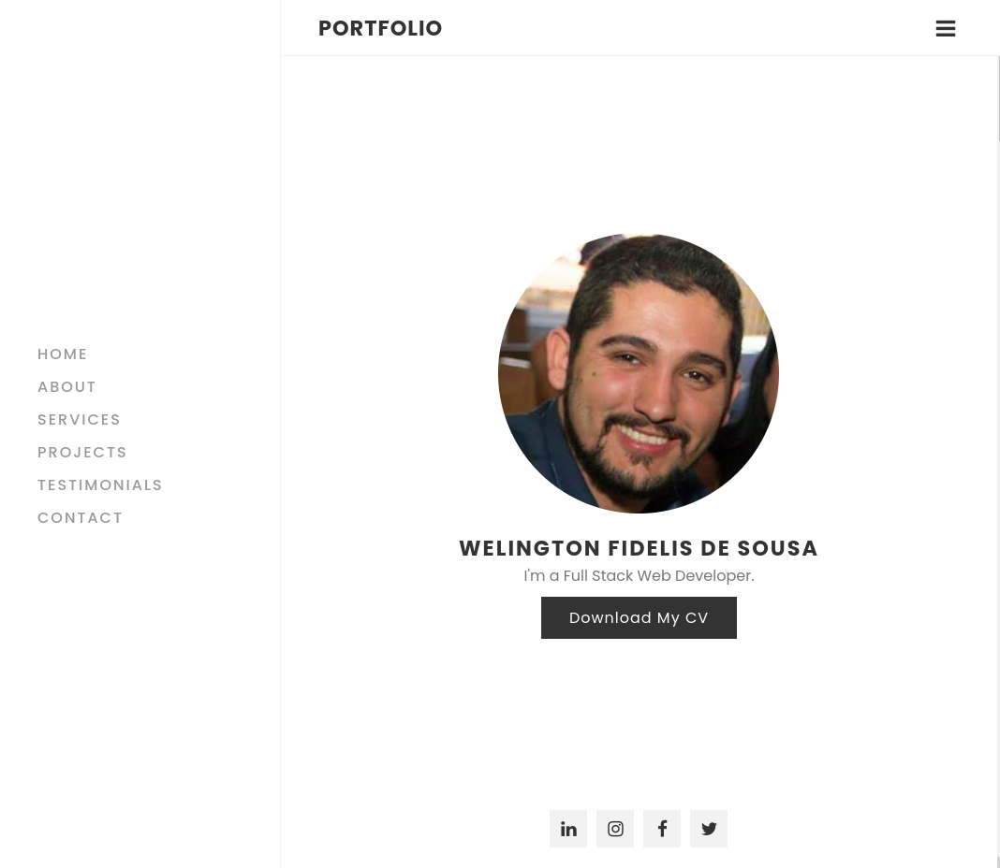
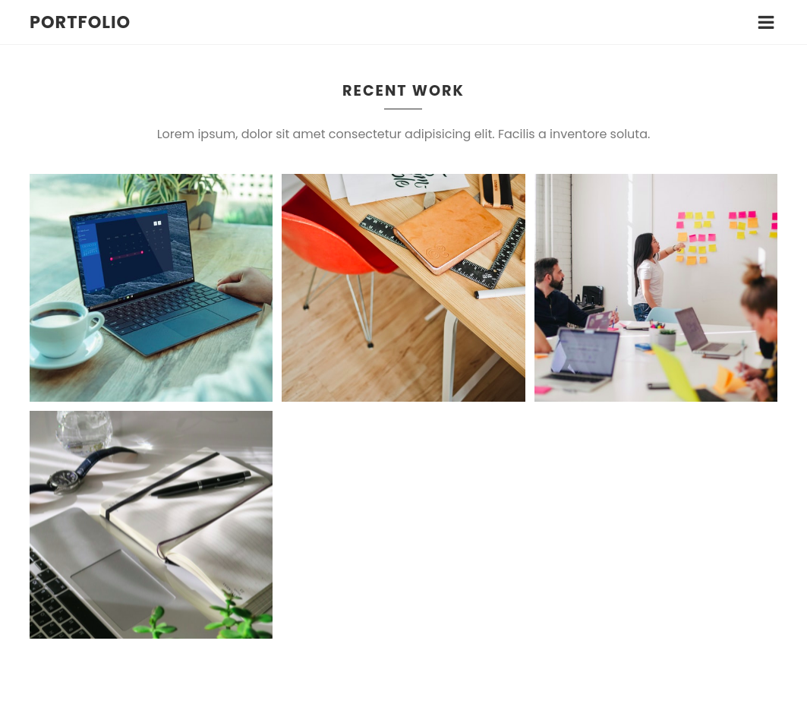
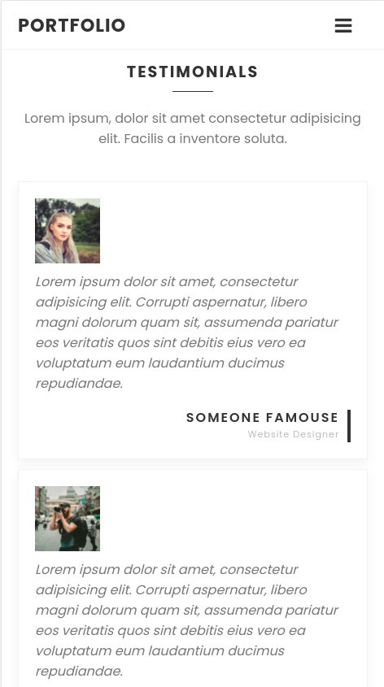
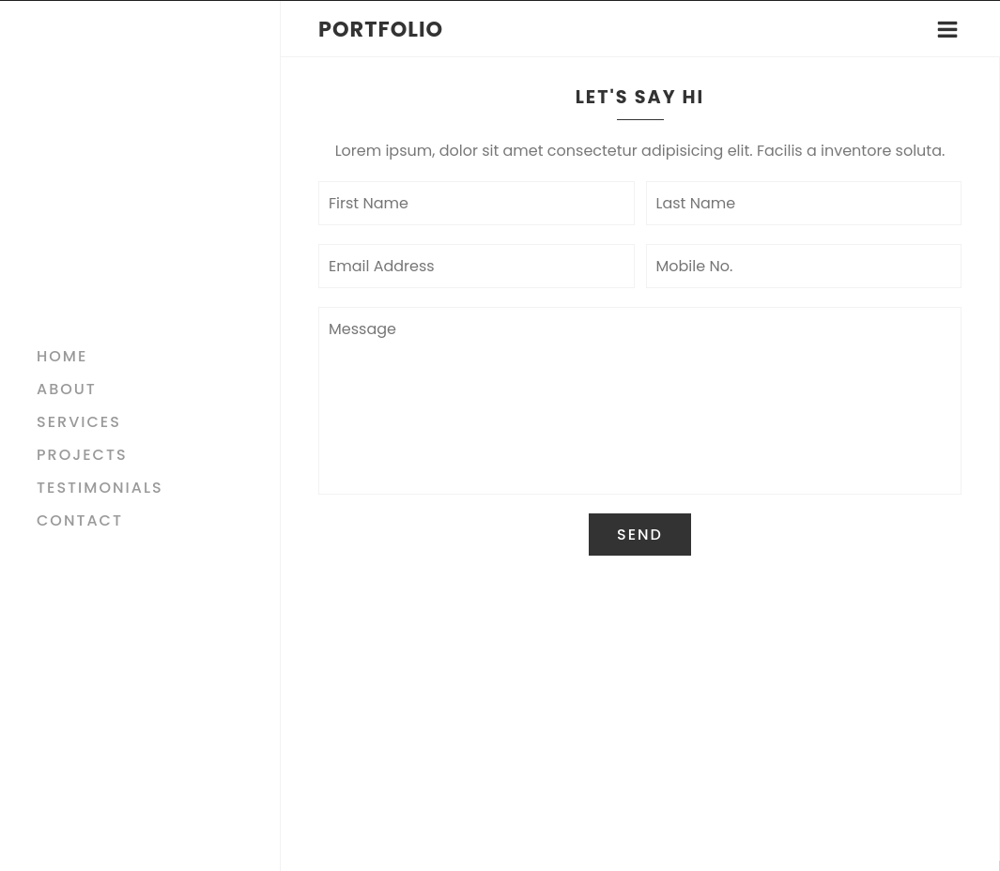

# Portfolio-project
Este projeto é resultado de uma playlist de cursos do canal [Online Tutorials] que teve como objetivo, criar um exemplo de portfólio responsivo com com HTML, CSS e Javascript.

## Apresentação
Abaixo algumas telas do projeto.

## Instalação
Após clonar este projeto, abra o arquivo index.html na raíz do projeto.

## Contato
welingtonfidelis@gmail.com
 
Sugestões e pull requests são sempre bem vindos 🤓 

License
----

MIT

**Free Software, Hell Yeah!**

[Online Tutorials]: <https://www.youtube.com/channel/UCbwXnUipZsLfUckBPsC7Jog>